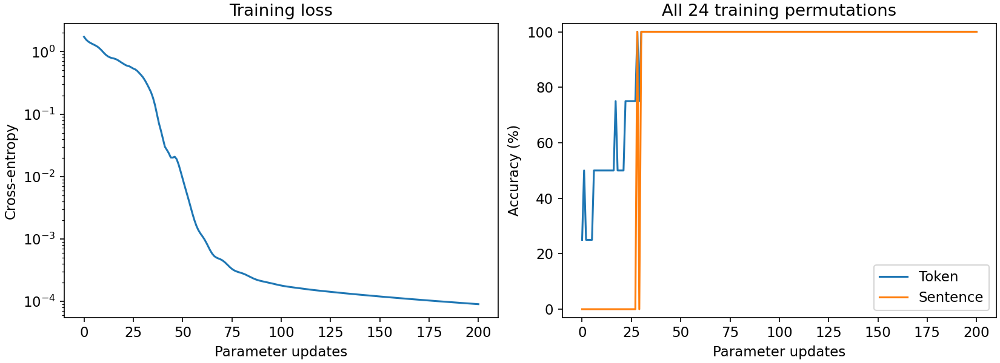
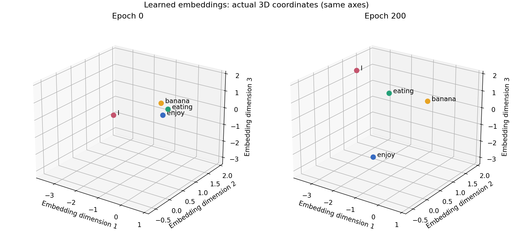
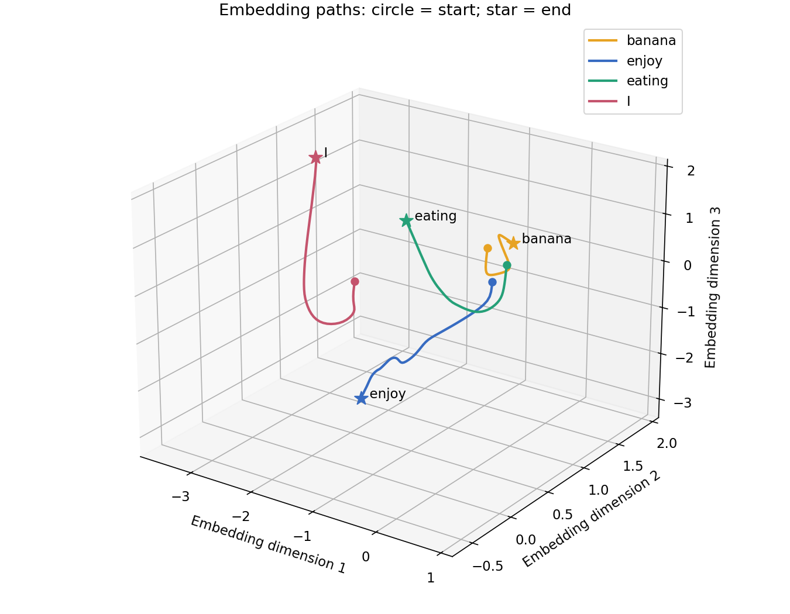
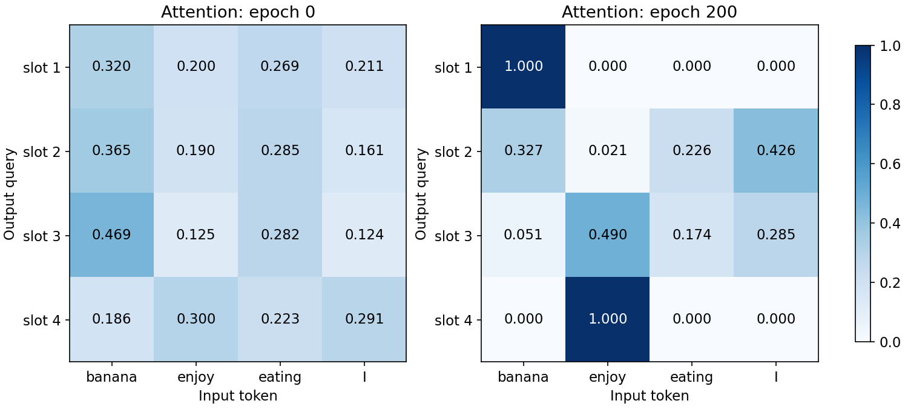

# Attention Is All You Need：学习笔记与简单复现

[English](README.md)

这个仓库是我学习论文 *Attention Is All You Need* 及 Transformer 架构时整理的学习笔记。其主要目的一方面帮助我自己循序渐进地理解论文及Transformer架构，也希望能有幸为和我一样刚接触这一主题的同学提供一个清晰、易懂的起点。

我不想把论文当作需要背诵的结论，而是希望通过「详细笔记 + 可复现的小型代码案例」把概念落到实处。每个案例都会尽量只聚焦一个核心问题，让分词、位置编码、注意力机制、掩码，以及编码器—解码器训练等内容，都能与实际可运行、可观察的代码对应起来。

## 仓库会包含什么

- 用尽量平实的语言逐步拆解论文的学习笔记
- 说明明确、可在 CPU 上运行的小型实验
- 方便阅读、修改和动手验证的代码与数据
- 持续记录学习过程中的问题、观察与实现取舍

## 版本计划

- v0：一个小型的词序还原任务：模型接收一个被打乱的四词句子，并学习生成语法正确的词序。维度控制在3维（原论文能够达到512维），以便可视化训练过程。此外，Multi-Head Attention, Positional Encoding, Feed Forward Network, Residual connection, LayerNorm, Encoder stack, autoregressive Decoder, masked self-attention等一系列概念均暂时跳过，仅用最简化的例子来快速入门Attention干了什么。本阶段将只使用CPU完成训练。
- v1：
- v2：依旧是词还原任务，但将训练范围扩大到小学词汇与更多句式。将尝试引入CUDA加速和显卡计算。
- v3：将尝试发展为关于“开学时间”FAQ的一个小问答模型，模型将从排序升级为排序+答案匹配，不可避免使用显卡完成计算。

## 接下来是一个v0版本，他将包括4个词，仅3维的embedding，54个参数：从矩阵乘法看见 attention，从链式法则看见训练。

这个项目记录我逐步理解 Transformer 的过程。v0 从一个极简任务开始：输入四个打乱顺序的词，输出固定句子 `I enjoy eating banana`。我们保留 attention 的核心计算，把每一步的中间矩阵、梯度和参数变化都记录下来。

> v0 是带可学习输出查询的单头 cross-attention 实验，不是原论文完整 Transformer，也不是自然语言语法学习的验证。本文数字来自随附代码的本次运行；之前讨论中的未核验训练数字已替换。初始 embedding 和 Query 沿用讨论中的三位小数，其余矩阵重新初始化。

## 1. 数据集

我们先初始化一个非常简单的只有4个词的词表，同时用简单的方式标注ID：1,2,3,4
词汇表与 token ID：

| Token | ID |
|---|---:|
| banana | 0 |
| enjoy | 1 |
| eating | 2 |
| I | 3 |

四个词的所有排列共 $4!=24$ 个。每个样本包含四个不同词，目标均为同一个句子：

| 输入 | 目标 |
|---|---|
| banana enjoy eating I | I enjoy eating banana |
| eating banana I enjoy | I enjoy eating banana |
| enjoy I banana eating | I enjoy eating banana |
| I eating enjoy banana | I enjoy eating banana |

完整数据见 [dataset.csv](results/dataset.csv)。24 个样本全部用于训练与训练集评估，没有独立测试集。单词准确率统计 96 个输出位置；整句准确率要求四个位置全部正确。

这个任务让我们观察模型如何降低 loss，但一个始终输出固定句子的程序也能获得 100%。因此，准确率不能证明模型学会了英语、识别了语法角色，或者 attention 是解决这个任务所必需的。

## 2. 模型有哪些可训练数字？

| 参数 | 形状 | 数量 | 作用 |
|---|---|---:|---|
| $E$ | $4\times3$ | 12 | 每个词的 embedding |
| $Q$ | $4\times3$ | 12 | 四个输出位置的查询向量 |
| $W_K$ | $3\times3$ | 9 | embedding → Key |
| $W_V$ | $3\times3$ | 9 | embedding → Value |
| $W_{\mathrm{out}}$ | $3\times4$ | 12 | context → 词汇 logits |
| 总计 | | **54** | 无 bias |

本实验的 $Q$ 是直接学习的参数，不是 $XW_Q$。每一行是一个输出槽位的查询：“为了生成这个位置，我应该从输入获取什么信息？”

输入产生 $K,V$，另一组输出查询提供 $Q$，所以这是 cross-attention。原论文中的 decoder 查询来自 decoder 的隐状态；这里用四个固定、可训练的向量作简化。$W_{\mathrm{out}}$ 是词汇分类矩阵，不是原论文 multi-head attention 中的输出投影 $W^O$。

## 3. 正向计算：词如何变成预测？

下文跟踪输入 `banana enjoy eating I`。输入行顺序与词汇 ID 顺序恰好相同。

### 3.1 Embedding：查表得到三维坐标

每个词对应 $\mathbb R^3$ 中的一个点。初始输入矩阵为：

$$
\begin{bmatrix}
-0.1470 & 0.7860 & 0.9470 \\
-1.1140 & 1.6910 & -0.8950 \\
-0.3560 & 1.2320 & 0.1380 \\
-1.6820 & 0.3180 & 0.1330
\end{bmatrix}
$$

这里 $X\in\mathbb R^{4\times3}$。每一行属于一个词，三列是其坐标。这些坐标没有预先规定的“代词维度”“水果维度”等语言含义，它们是训练可以修改的数字。

### 3.2 Query、Key 和 Value

四个输出槽位的初始查询：

$$
Q=\begin{bmatrix}
0.0270 & 0.0480 & 0.2790 \\
0.2690 & 0.4880 & 0.0410 \\
0.4900 & 0.4050 & 0.3560 \\
-0.1840 & -0.0920 & -0.1450
\end{bmatrix}
$$

输入通过两个共享矩阵产生 Key 与 Value：

$$
K=XW_K,\qquad V=XW_V.
$$

本次初始化后的计算结果：

$$
K=\begin{bmatrix}
1.9395 & 2.1935 & 0.9463 \\
-0.0395 & 1.1790 & -1.6189 \\
1.1252 & 1.8462 & -0.0008 \\
0.3021 & 0.3696 & -1.1813
\end{bmatrix}
$$

$$
V=\begin{bmatrix}
0.3291 & 0.4707 & 1.9405 \\
2.1514 & -1.5105 & 1.2405 \\
1.0510 & -0.4843 & 1.5937 \\
1.0801 & 0.3861 & 1.1850
\end{bmatrix}
$$

Key 用来计算查询与输入的匹配分数，Value 是按 attention 权重混合的内容。所有投影矩阵的实际数值可在 [run.json](results/run.json) 的 `initial_parameters` 中检查。

### 3.3 点积得到匹配分数

$$
S=\frac{QK^T}{\sqrt{d_k}}=\frac{QK^T}{\sqrt3}.
$$

$Q$ 为 $4\times3$，$K^T$ 为 $3\times4$，所以 $S$ 为 $4\times4$。第 $i$ 行、第 $j$ 列表示输出槽位 $i$ 对输入位置 $j$ 的分数。

例如第一项：

$$
S_{11}=\frac{q_1\cdot k_{\mathrm{banana}}}{\sqrt3}
=\frac{(0.0270)(1.9395) + (0.0480)(2.1935) + (0.2790)(0.9463)}{\sqrt3}\approx 0.2435.
$$

得到整个分数矩阵：

$$
\begin{bmatrix}
0.2435 & -0.2287 & 0.0686 & -0.1753 \\
0.9416 & 0.2877 & 0.6949 & 0.1231 \\
1.2561 & -0.0682 & 0.7498 & -0.0709 \\
-0.4018 & 0.0771 & -0.2175 & 0.0472
\end{bmatrix}
$$

除以 $\sqrt{d_k}$ 是为了控制点积的尺度：在各分量独立、均值为零、方差为一的简化假设下，点积方差随 $d_k$ 增长。缩放有助于避免 softmax 过早变得极端。这不是“三维必须除”的代数规则，而是模型的设计选择。

### 3.4 Softmax：每一行变成权重

$$
A_{ij}=\frac{e^{S_{ij}}}{\sum_{k=1}^4 e^{S_{ik}}}.
$$

我们对输入维度，也就是每一行的四列做 softmax：

$$
\begin{bmatrix}
0.3204 & 0.1998 & 0.2690 & 0.2108 \\
0.3646 & 0.1896 & 0.2849 & 0.1608 \\
0.4686 & 0.1246 & 0.2824 & 0.1243 \\
0.1858 & 0.2999 & 0.2233 & 0.2910
\end{bmatrix}
$$

每一行的权重为正，且总和为 1。第一行表示输出第一个位置时，输入四个 Value 分别占多少比例。Attention 权重是计算结果，不是独立存储的可训练参数。

### 3.5 加权混合 Value

$$
C=AV\in\mathbb R^{4\times3}.
$$

具体来说：

$$
c_1=A_{11}v_{\mathrm{banana}}+A_{12}v_{\mathrm{enjoy}}
+A_{13}v_{\mathrm{eating}}+A_{14}v_I.
$$

得到：

$$
\begin{bmatrix}
1.0457 & -0.1999 & 1.5481 \\
1.0011 & -0.1907 & 1.5874 \\
0.8535 & -0.0565 & 1.6614 \\
1.2554 & -0.3613 & 1.4333
\end{bmatrix}
$$

这一步仍然只得到四个三维向量，还没有直接生成词。

### 3.6 Context → logits → 概率

$$
Z=CW_{\mathrm{out}}\in\mathbb R^{4\times4},\qquad
P=\operatorname{softmax}_{\mathrm{row}}(Z).
$$

$Z$ 每行有四个 logits，分别对应 `[banana, enjoy, eating, I]`。Logit 是未经归一化的分数，可以为负；softmax 后才是概率。

第一个输出位置的初始概率：

$$
P_{1,:}=\begin{bmatrix}0.313806 & 0.171390 & 0.042492 & 0.472312\end{bmatrix}
$$

预测取每行概率最大的词。初始预测为 `I I I I`，而目标是 `I enjoy eating banana`。

## 4. Loss：把四个位置的错误汇总成一个数

令 $y_i$ 表示输出位置 $i$ 的正确词汇 ID。对一个样本：

$$
L=-\frac14\sum_{i=1}^4\ln P_{i,y_i}.
$$

第一位置正确答案是 `I`，故它单独的损失为：

$$
L_1=-\ln P_{1,I}=-\ln(0.472312)\approx 0.750115.
$$

将四个位置的 loss 取平均，本次初始 loss 为 **1.72783733**。如果每个词的概率均为 $1/4$，loss 为 $\ln4\approx1.3863$。随机初始化模型并不必然恰好得到均匀概率，也可能比均匀预测更差。

代码使用 `cross_entropy(logits, target)`，直接传入 logits。PyTorch 在内部处理 log-softmax 与交叉熵，不应先把 logits 做 softmax 再传给这个函数。

## 5. PyTorch 如何知道每个数字应该怎么改？

核心是**自动微分与链式法则**。计算正向结果时，autograd 记录参与运算的张量之间的依赖，并保存反向计算需要的信息。

例如：

$$
X\longrightarrow K\longrightarrow S\longrightarrow A\longrightarrow C\longrightarrow Z\longrightarrow L.
$$

还有另一条路径 $X\to V\to C\to Z\to L$。同一个参数经多条路径影响 loss 时，各条路径的梯度贡献相加。

`loss.backward()` 沿这些依赖反向计算偏导，写入参数的 `.grad`；它本身不会修改参数。`optimizer.step()` 才根据梯度和优化器状态更新参数。

### 5.1 从单个数字理解更新

若 $L(w)=(w-5)^2$，从 $w=2$ 开始，有 $L'(w)=-6$。采用 SGD、学习率 $\eta=0.1$：

$$
w_{\mathrm{new}}=w-\eta L'(w)=2.6.
$$

Embedding 的每个坐标、矩阵的每个元素也都有自己的偏导。若某个坐标梯度为负，SGD 会增加该坐标；梯度为正则会减小它。

不是依次把 54 个数逐个调到最终值：一次 backward 在**当前同一组参数**处计算所有偏导，一次 step 更新这组参数，再重新做正向计算。

### 5.2 为什么一起更新有数学依据？

将所有参数展平为向量 $\theta$，小扰动的一阶近似为：

$$
L(\theta+\Delta\theta)\approx L(\theta)+\nabla L(\theta)^T\Delta\theta.
$$

采用 SGD 的 $\Delta\theta=-\eta\nabla L$：

$$
L(\theta-\eta\nabla L)\approx L(\theta)-\eta\|\nabla L\|^2.
$$

这解释了足够小的负梯度步为什么可以降低 loss。不过这是局部近似；较大步长、随机批次以及 Adam 等优化器都不保证每一步的实际 loss 单调下降，也不保证达到全局最小值。

## 6. 反向计算：从 loss 一路回到 embedding

用 $G_T=\partial L/\partial T$ 表示与 $T$ 同形状的梯度。以下公式针对**一个样本、四个位置取平均**，所有数值在初始参数处计算。

### 6.1 Softmax 与交叉熵的梯度

令 $Y$ 为正确答案的 one-hot 矩阵：

$$
G_Z=\frac{P-Y}{4}.
$$

单个位置单独求损失时，梯度是 $p-y$；这里整体取平均，所以必须除以 4。若平均的是全批次的 96 个位置，则相应除以 96，再汇总共享参数的贡献。

第一行：

$$
(G_Z)_{1,:}=\begin{bmatrix}0.078451 & 0.042848 & 0.010623 & -0.131922\end{bmatrix}.
$$

对正确词的 logit，直接梯度为负；其他词为正。这表示损失在 logit 空间的局部变化方向。实际模型修改的是上游共享参数，并非独立修改每一个 logit。

### 6.2 输出投影

由 $Z=CW_{\mathrm{out}}$：

$$
G_{W_{\mathrm{out}}}=C^TG_Z,\qquad
G_C=G_ZW_{\mathrm{out}}^T.
$$

一份梯度用于更新输出矩阵，另一份继续传回 context。

### 6.3 Value 与 attention 权重

由 $C=AV$：

$$
G_A=G_CV^T,\qquad G_V=A^TG_C.
$$

$G_A$ 描述权重变化如何影响损失，但优化器不直接更新 $A$；还必须穿过产生它的 softmax。

### 6.4 穿过 softmax

同一行的权重互相耦合，提高一个分数会影响整行权重。公式为：

$$
(G_S)_{ij}=A_{ij}\left((G_A)_{ij}-\sum_{k=1}^4 A_{ik}(G_A)_{ik}\right).
$$

因此，不能简单把“某个权重该增加”理解为只改一个独立数值。

### 6.5 Query 与 Key

由 $S=QK^T/\sqrt3$：

$$
G_Q=\frac{G_SK}{\sqrt3},\qquad
G_K=\frac{G_S^TQ}{\sqrt3}.
$$

这一步把损失变化传回匹配分数的两侧。点积由方向和长度共同决定，不能把训练过程简化为“两个向量一定会越来越平行”。

### 6.6 投影与 embedding

由 $K=XW_K$ 与 $V=XW_V$：

$$
G_{W_K}=X^TG_K,\qquad G_{W_V}=X^TG_V,
$$

$$
G_X=G_KW_K^T+G_VW_V^T.
$$

最后这个加号是关键：embedding 同时通过 Key 与 Value 两条路径影响 loss，必须累加两条贡献。查表操作再把 $G_X$ 的每行送回对应词汇 ID 的 embedding；若同一词重复出现或出现在多个样本中，则累加所有出现位置的贡献。

这些矩阵公式就是 autograd 自动执行的链式法则。随附代码按公式独立计算全部五组参数的梯度，并与 PyTorch 比较。

## 7. 检验：自动梯度、手算公式与有限差分

选择第一个查询的第一个坐标 $q_{11}=0.027$，用初始模型、输入 `banana enjoy eating I`，比较：

$$
\frac{\partial L}{\partial q_{11}}
\approx\frac{L(q_{11}+\epsilon)-L(q_{11}-\epsilon)}{2\epsilon},\qquad
\epsilon=10^{-5}.
$$

| 方法 | 结果 |
|---|---:|
| PyTorch autograd | -0.038980040027 |
| 中心有限差分 | -0.038980040018 |
| 两者绝对误差 | 8.66e-12 |
| 全部手算参数梯度与 autograd 的最大绝对误差 | 2.78e-17 |

这项检查使用 float64。有限差分只是验证工具，训练没有靠对每个参数加减一次来估算导数；反向传播利用局部导数与链式法则，更高效地求出全部梯度。

举例：如果在该点使用学习率 $0.01$ 的 SGD，则 $q_{11}$ 会从 $0.027$ 更新到 **0.027389800**。这是展示 SGD 公式的计算示例；下面的实际实验使用 Adam。

## 8. 真正的训练循环

```python
optimizer = torch.optim.Adam(model.parameters(), lr=0.05)

for epoch in range(200):
    optimizer.zero_grad()                 # 清除旧梯度
    logits = model(tokens)                # 正向计算
    loss = torch.nn.functional.cross_entropy(
        logits.reshape(-1, 4), targets.reshape(-1)
    )
    loss.backward()                       # 计算每个参数的梯度
    optimizer.step()                      # 更新参数
```

每轮把全部 24 个样本作为一个 batch，完成一次参数更新，所以本实验中一个 epoch 等于一次 optimizer step。Epoch 0 表示尚未更新。

Adam 对每个坐标跟踪梯度的一阶、二阶矩估计，并进行偏差校正，再用它们调整更新量。因而实际更新量不是简单的 $\eta$ 乘当前梯度；$\theta\leftarrow\theta-\eta\nabla L$ 是普通 SGD 的公式。

可训练的是 $E,Q,W_K,W_V,W_{\mathrm{out}}$。$X,K,V,S,A,C,Z,P$ 是当前参数与当前输入计算出来的中间结果，下一轮会重新计算。

## 9. 本次运行结果

设置：seed = 7，CPU，float64，Adam，learning rate = 0.05，200 次更新。运行环境为 Python 3.12.14、PyTorch 2.14.0+cpu。完整记录见 [training.csv](results/training.csv) 与 [run.json](results/run.json)。不同软件版本或计算环境可能带来数值差异。

| Epoch | Loss | 单词准确率 | 整句准确率 |
|---:|---:|---:|---:|
| 0 | 1.72783733 | 25% | 0% |
| 1 | 1.56460382 | 50% | 0% |
| 2 | 1.46122802 | 25% | 0% |
| 5 | 1.29390596 | 25% | 0% |
| 10 | 0.96085996 | 50% | 0% |
| 20 | 0.63846311 | 50% | 0% |
| 50 | 0.00924514 | 100% | 100% |
| 100 | 0.00017987 | 100% | 100% |
| 200 | 0.00009054 | 100% | 100% |



训练后，下列输入均输出 `I enjoy eating banana`：

```text
banana enjoy eating I
  → I enjoy eating banana

eating I enjoy banana
  → I enjoy eating banana

I banana eating enjoy
  → I enjoy eating banana
```

这里没有输入位置编码。对输入置换矩阵 $R$，有 $K'=RK$、$V'=RV$，于是 $S'=SR^T$、$A'=AR^T$，最终：

$$
C'=A'V'=AR^TRV=AV=C.
$$

因此该架构对输入排列不变：24 个输入本质上给模型提供相同的信息，而非 24 个独立的理解挑战。代码还验证了全部排列产生的 logits 在浮点误差范围内一致。

## 10. 把三维向量直接画出来

由于 embedding 本身就是三维，不需要 PCA 或 t-SNE 降维。下面直接画三个真实坐标；训练前后使用相同的轴范围与视角。



| Token | 初始坐标 | 200 次更新后 |
|---|---|---|
| banana | (-0.147, 0.786, 0.947) | (0.766, 0.335, 1.742) |
| enjoy | (-1.114, 1.691, -0.895) | (-2.194, 0.790, -3.013) |
| eating | (-0.356, 1.232, 0.138) | (-1.778, 1.060, 0.747) |
| I | (-1.682, 0.318, 0.133) | (-3.459, 1.198, 1.441) |

记录每一次更新后的位置，可以得到四条移动轨迹：圆点为起点，星形为终点，每种颜色始终对应同一个词。



轨迹说明参数确实在改变，但坐标轴没有固定语义，距离也不能在这个微型任务中直接解释为普遍的语义相似度。不同初始化可能得到不同坐标，而产生同样预测。

GitHub README 使用相对路径嵌入 PNG。把 `README.md` 与 `assets/` 一起提交即可显示这些图；图片是三维空间的静态投影，不能在 README 中拖动旋转。

## 11. 一个重要观察：输出 `I` 不一定最关注 `I`



横轴是输入 `banana enjoy eating I`，纵轴是四个输出槽位。最终第一个槽位对 `banana` 的权重约为 **99.95%**，但预测为 `I`。

这是合法的，因为模型计算的是：

$$
\text{输入}\to \text{Value 混合}\to \text{可学习的词汇分类矩阵}\to \text{预测}.
$$

Value 与分类矩阵可以共同学习一种编码，使来自 `banana` 的信息帮助输出 `I`。训练只约束最后预测的损失，并没有规定 attention 必须逐词对齐。因此，“输出第一位应该是 I，所以第一位一定逐渐最关注 I”并不是该模型的保证。

这也说明 attention 热力图与预测概率是两种不同的量：前者分配输入信息，后者在词汇表上分配输出概率。

## 12. 如何运行与放到 GitHub

项目文件：

| 路径 | 内容 |
|---|---|
| `README.md` | 本文 |
| `train.py` | 模型、训练、手算梯度检查、有限差分与绘图 |
| `requirements.txt` | 本次实验使用的依赖版本 |
| `assets/` | README 使用的四张图 |
| `results/dataset.csv` | 所有 24 个样本 |
| `results/training.csv` | 每轮 loss 与准确率 |
| `results/run.json` | 参数、embedding 轨迹、中间矩阵与梯度验证 |

使用 Python 3.12，在项目文件夹中运行：

```bash
python -m venv .venv
# macOS / Linux
source .venv/bin/activate
# Windows PowerShell 使用：.venv\Scripts\Activate.ps1
python -m pip install -r requirements.txt
python train.py
```

运行会重新生成 `assets/` 与 `results/`。要发布本次 v0，上传这些项目文件即可；不要上传本地虚拟环境 `.venv/`。

## 13. 与完整 Transformer 的关系及后续实验

v0 保留 scaled dot-product attention、softmax、可训练 embedding、交叉熵与反向传播。尚未加入 multi-head attention、输入位置编码、FFN、残差连接、LayerNorm、encoder 堆叠、自回归 decoder 与 causal mask。

后续计划：

- [ ] 使用不同词集合与不同目标句，让输出必须依赖输入内容。
- [ ] 加入始终输出固定句子的 baseline，明确它在什么任务上失效。
- [ ] 分别冻结 embedding、查询或投影，观察参数如何协作。
- [ ] 加入无 attention 的 baseline，比较不同结构。
- [ ] 再逐步加入位置编码、多头注意力、FFN、残差与 LayerNorm。
- [ ] 扩展到自回归 encoder–decoder，并在独立数据上评估。

v0 的收获是将一个抽象公式拆成能计算、能检查的过程：**预测由参数决定，loss 衡量当前预测，链式法则计算参数的局部影响，优化器反复据此更新参数。**

## 参考资料

- [PyTorch: Autograd mechanics](https://docs.pytorch.org/docs/2.14/notes/autograd.html)
- [PyTorch: CrossEntropyLoss](https://docs.pytorch.org/docs/2.14/generated/torch.nn.CrossEntropyLoss.html)


